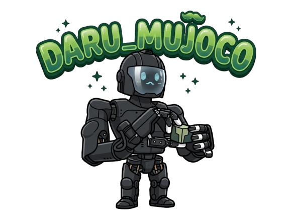

<p align="center">
  
</p>

[](https://github.com/Chanwoochan/daru_mujoco)
[](https://github.com/Chanwoochan/daru_mujoco/actions)
[](https://github.com/psf/black)
[](https://pycqa.github.io/isort/)
[](https://github.com/Chanwoochan/daru_mujoco/stargazers)
[](https://github.com/Chanwoochan/daru_mujoco/issues)

<p align="center">
  
</p>

DARU V4 MuJoCo simulator package for ROS 2.

> Warning
> This repository is still under active development and is not complete yet.

This simulator is based on a robot platform developed by RcLab.

- RcLab: https://www.youtube.com/rclab

This package contains:

- a MuJoCo-based DARU V4 simulator
- a teleoperation executable
- a GR00T inference executable
- vendored runtime dependencies for MuJoCo, RBDL, and GLFW

## External Assets And Dependencies

This repository includes or references external components.

- `urdf/furniture_sim`
  Imported furniture simulation assets. See [urdf/furniture_sim/README.md](/home/rclab/daru_ws/daru_mujoco/urdf/furniture_sim/README.md) and [urdf/furniture_sim/LICENSE](/home/rclab/daru_ws/daru_mujoco/urdf/furniture_sim/LICENSE).
- `third_party/mujoco-3.4.0`
  Vendored MuJoCo runtime files used by this simulator.
- `third_party/rbdl`
  Vendored RBDL headers and libraries. See [third_party/rbdl/README.local-vendored.md](/home/rclab/daru_ws/daru_mujoco/third_party/rbdl/README.local-vendored.md).
- `third_party/glfw`
  Vendored GLFW headers and libraries used at runtime.

## Features

- ROS 2 package layout based on `ament_cmake`
- default MJCF and URDF paths when launched without arguments
- installed package-share resource lookup via `ament_index_cpp`
- vendored `MuJoCo`, `RBDL`, and `GLFW` support
- separate MOB variant available as `kcwarm_mujoco_mob`

## Package Layout

```text
daru_mujoco/
├── include/
├── src/
├── urdf/
├── resource/
├── third_party/
│   ├── mujoco-3.4.0/
│   ├── rbdl/
│   └── glfw/
├── CMakeLists.txt
└── package.xml
```

## Requirements

Tested on:

- Ubuntu 22.04
- ROS 2
- CMake 3.8+
- C++17

Still expected from the host system:

- ROS 2 environment
- OpenGL-capable graphics stack
- OpenCV development packages
- Cairo development packages
- `libcurl`
- `libtiff`
- `Eigen3`

Notes:

- `MuJoCo`, `RBDL`, and `GLFW` are bundled under `third_party/`.
- `OpenGL` is not vendored. It must come from the system graphics stack.
- If Conda is active, it can override system `libcurl` or `libtiff` and break linking. Build in a clean ROS shell if possible.

## install

Assumption:

- ROS 2 is already installed.
- Ubuntu shell is used.
- Build from a clean shell. If Conda is active, run `conda deactivate` first.

Install system dependencies:

```bash
sudo apt update
sudo apt install -y python3-rosdep
sudo rosdep init
rosdep update
```

From the workspace root:

```bash
cd ~/your_ws
git clone https://github.com/Chanwoochan/daru_mujoco.git
source /opt/ros/$ROS_DISTRO/setup.bash
rosdep install --from-paths src --ignore-src -r -y
colcon build --packages-select daru_mujoco
source install/setup.bash
```

If `rosdep` is unavailable or a package mirror is misconfigured, install the required Ubuntu packages directly:

```bash
sudo apt update
sudo apt install -y \
  build-essential \
  cmake \
  pkg-config \
  libcairo2-dev \
  libopencv-dev \
  libtiff-dev \
  libcurl4-openssl-dev \
  libgl1-mesa-dev \
  libx11-dev \
  libxrandr-dev \
  libxinerama-dev \
  libxcursor-dev \
  libxi-dev
```

## Run

Default launch:

```bash
ros2 run daru_mujoco daru_v4_mujoco_teleop_sim
```

Explicit file paths:

```bash
ros2 run daru_mujoco daru_v4_mujoco_teleop_sim \
  daru_mujoco/urdf/DARU_NEW_260323/scene.xml \
  daru_mujoco/urdf/DARU_V4.urdf
```

GR00T inference executable:

```bash
ros2 run daru_mujoco daru_v4_mujoco_gr00t_infer_sim
```

Argument format:

```text
daru_v4_mujoco_teleop_sim [scene.xml] [robot.urdf] [steps]
daru_v4_mujoco_gr00t_infer_sim [scene.xml] [robot.urdf] [steps]
```

If no file arguments are given, the package uses its installed default MJCF and URDF files.

## Vendored Dependencies

The package prefers local vendored copies before falling back to system libraries.

- `third_party/mujoco-3.4.0`
- `third_party/rbdl`
- `third_party/glfw`

Installed executables use local packaged copies of these libraries through `RPATH`, so runtime does not depend on `/usr/local/lib` or other machine-specific absolute paths.

## Repository Readiness

What is already handled:

- hardcoded source absolute paths removed
- installed-share resource lookup enabled
- vendored runtime libraries wired into CMake
- default runtime asset paths available without CLI arguments

What should still be finalized before public release:

- replace placeholder license field in [package.xml](/home/rclab/daru_ws/daru_mujoco/package.xml)
- add upstream license texts for vendored third-party components
- document exact apt dependencies if you want one-command setup for new users

## License

Project license is not finalized yet. The current [package.xml](/home/rclab/daru_ws/daru_mujoco/package.xml) still contains a placeholder value and should be updated before publishing.
